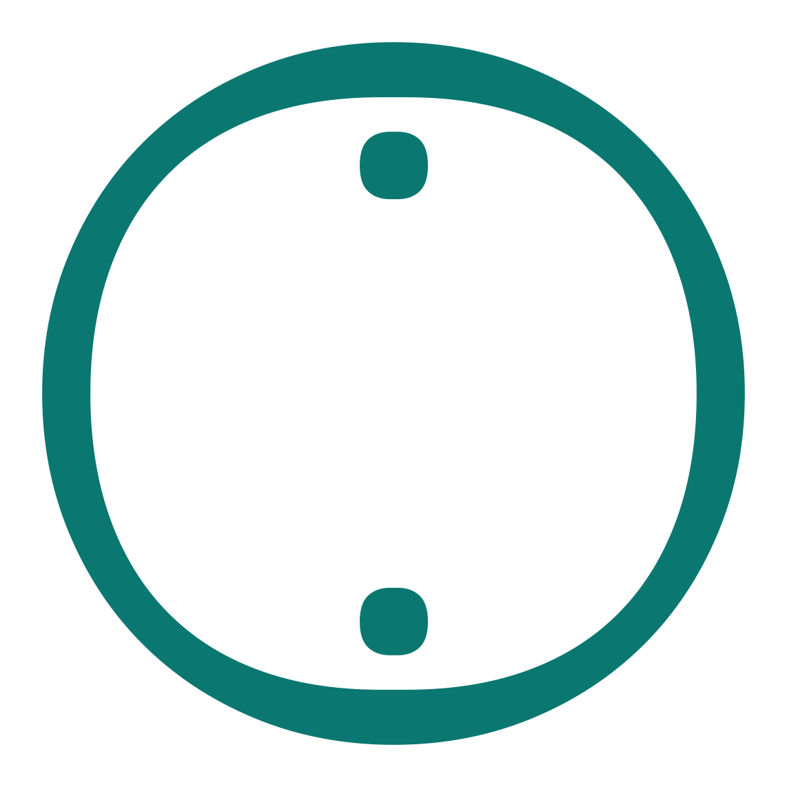
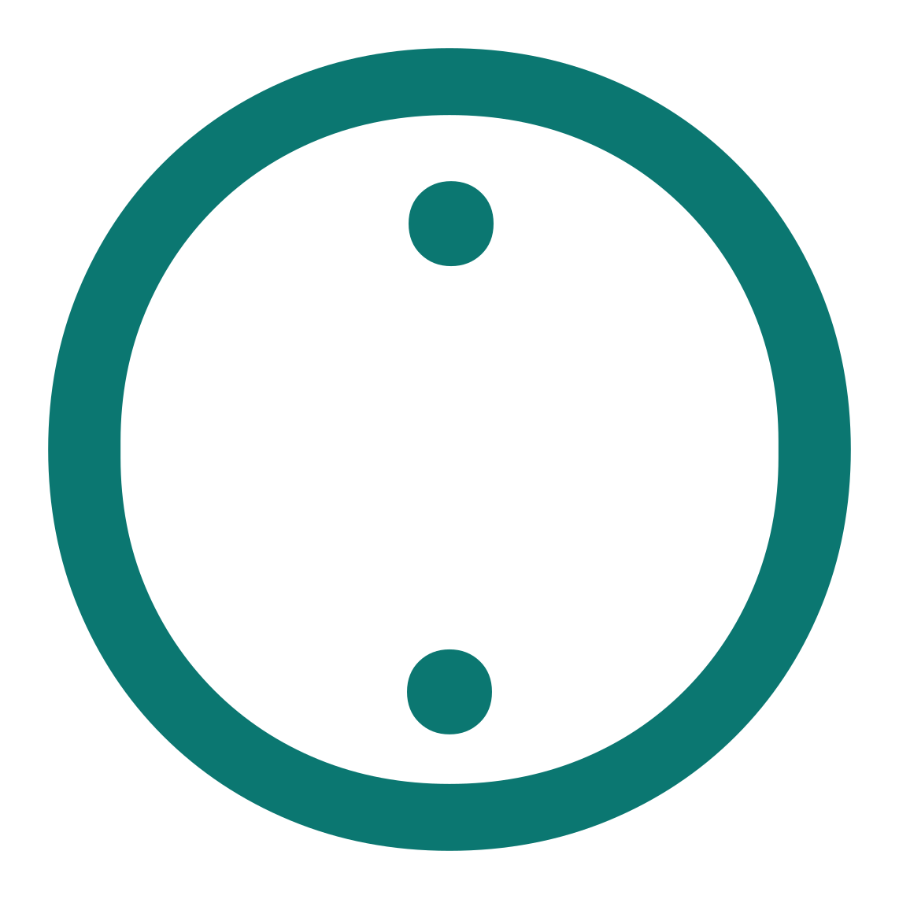
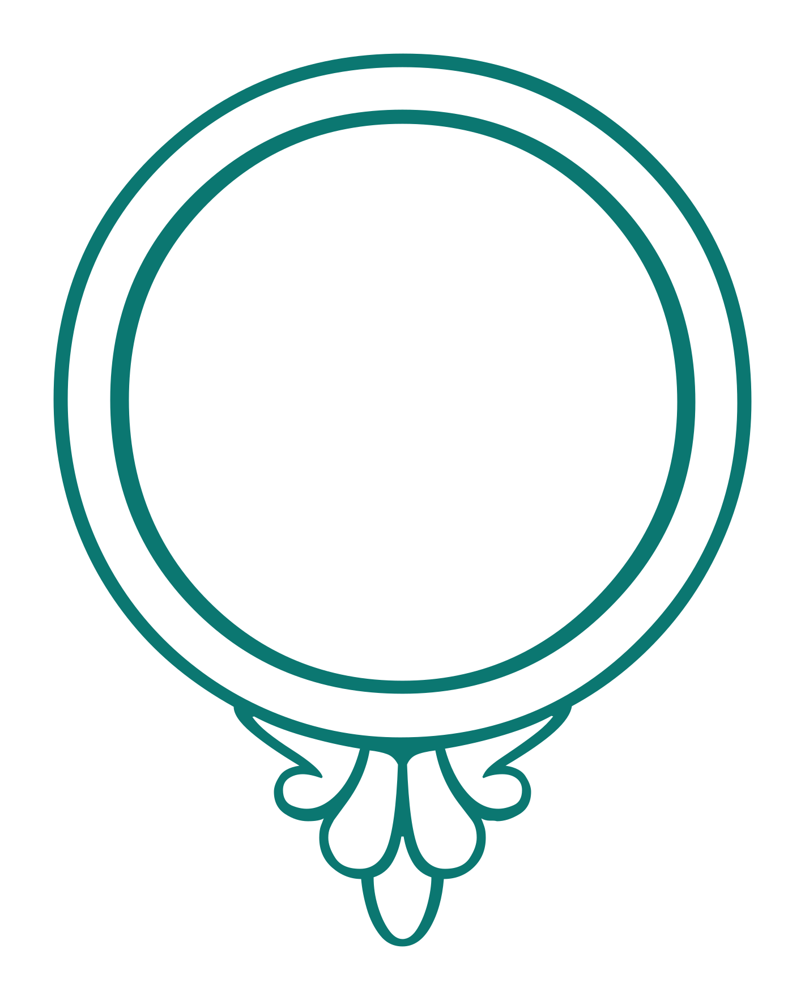
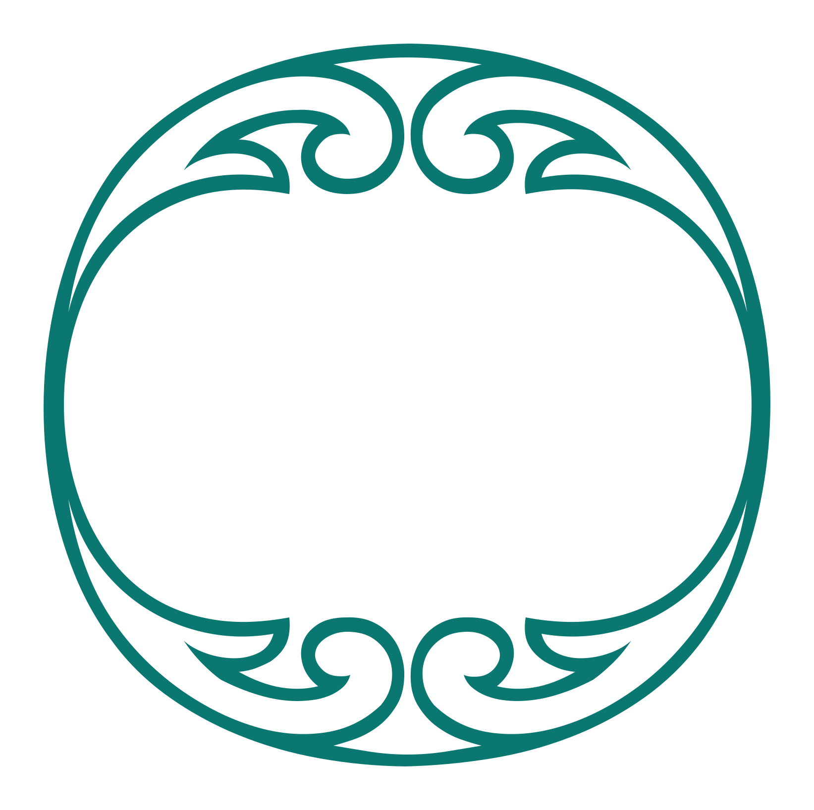
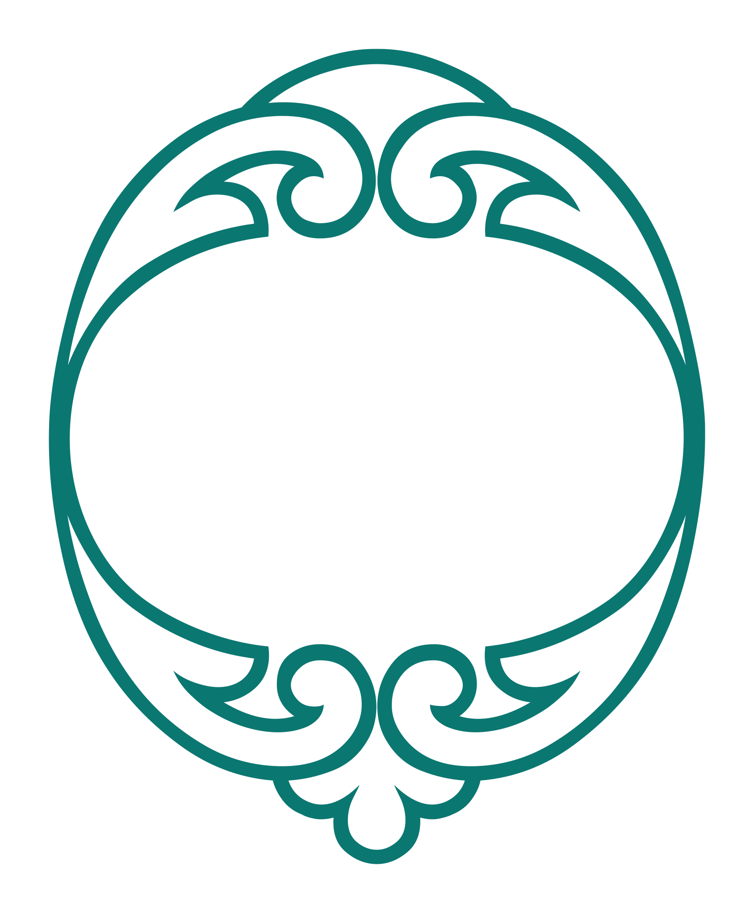

<h1 align="center">Ayah Markers</h1>

<p align="center">
  <strong>Qur’anic end-of-ayah marks as SVG outlines and a font.</strong><br>
  <sub>20 designs · 47 weights · every layer recoloured from CSS</sub>
</p>

<p align="center">         </p>

<p align="center">
  <a href="https://quranpedia.github.io/ayah-markers/demo/"><strong>Open the demo →</strong></a>
  &nbsp;·&nbsp; <a href="dist/AyahMarkers.otf">OTF</a>
  &nbsp;·&nbsp; <a href="dist/AyahMarkers.ttf">TTF</a>
  &nbsp;·&nbsp; <a href="docs/USAGE.md">SVG guide</a>
</p>

<p align="center">
  <sub>Every marker is a <code>&lt;g&gt;</code> per colour filled through a CSS variable — drop one in,
  set <code>--ink-1</code>, done. Open the demo to pick colours and download the file with them baked in.</sub>
</p>

---

## Use the SVGs

Drop a file from `markers/` into your page and set the variables it uses — the
file is already layered, so the CSS styles it directly. Pick a design in the demo,
choose its weight, set the colours, then **Copy CSS** for exactly this block, or
**Download SVG** for the same marker with those colours written into the file:

```css
/* 001-regular */
.ayah-marker {
  --fill-base: #fff8e7;
  --fill-1: #f4e9bc;
  --fill-2: #d6ad43;
  --ink-base: #083a3a;
}
```

Every available variable is listed in the [SVG guide](docs/USAGE.md), along with
where to put the ayah number: `collection.json` gives each marker one centre and
the box it holds, in the SVG's own coordinates, because a marker's number rarely
sits at the middle of its bounding box.

## Use the font

Markers are mapped to the Private Use Area from U+E000. See [font-map.json](dist/font-map.json) for the glyph you want.

```css
@font-face {
  font-family: "Ayah Markers";
  src: url("./AyahMarkers.otf") format("opentype");
}

.ayah-mark { font-family: "Ayah Markers"; }
```

```html
<span class="ayah-mark">&#xE000;</span>
```

## Markers

| | Design | Weights |
| --- | --- | --- |
|  | **001** | [Regular](markers/001-regular.svg) |
|  | **002** | [Regular](markers/002-regular.svg) · [Bold](markers/002-bold.svg) |
|  | **003** | [Thin](markers/003-thin.svg) · [ExtraLight](markers/003-extralight.svg) · [Light](markers/003-light.svg) · [Regular](markers/003-regular.svg) · [Medium](markers/003-medium.svg) · [SemiBold](markers/003-semibold.svg) · [Bold](markers/003-bold.svg) · [ExtraBold](markers/003-extrabold.svg) · [Black](markers/003-black.svg) |
|  | **004** | [Thin](markers/004-thin.svg) · [ExtraLight](markers/004-extralight.svg) · [Light](markers/004-light.svg) · [Regular](markers/004-regular.svg) · [Medium](markers/004-medium.svg) · [SemiBold](markers/004-semibold.svg) · [Bold](markers/004-bold.svg) |
|  | **005** | [Regular](markers/005-regular.svg) |
|  | **006** | [Regular](markers/006-regular.svg) |
|  | **007** | [Regular](markers/007-regular.svg) · [Medium](markers/007-medium.svg) · [Bold](markers/007-bold.svg) |
|  | **008** | [ExtraLight](markers/008-extralight.svg) · [Light](markers/008-light.svg) · [Medium](markers/008-medium.svg) · [Bold](markers/008-bold.svg) · [Black](markers/008-black.svg) |
|  | **009** | [Medium](markers/009-medium.svg) |
|  | **010** | [Regular Bold](markers/010-regular-bold.svg) |
|  | **011** | [Regular Bold](markers/011-regular-bold.svg) |
|  | **012** | [Thin](markers/012-thin.svg) · [ExtraLight](markers/012-extralight.svg) · [Light](markers/012-light.svg) · [Regular Black](markers/012-regular-black.svg) |
|  | **013** | [Regular](markers/013-regular.svg) · [Medium](markers/013-medium.svg) · [SemiBold](markers/013-semibold.svg) · [Bold](markers/013-bold.svg) |
|  | **014** | [Regular](markers/014-regular.svg) |
|  | **015** | [Regular](markers/015-regular.svg) |
|  | **016** | [Regular](markers/016-regular.svg) |
|  | **017** | [Regular](markers/017-regular.svg) |
|  | **018** | [Regular](markers/018-regular.svg) |
|  | **019** | [Regular](markers/019-regular.svg) |
|  | **020** | [Regular](markers/020-regular.svg) |

Each file is a plain SVG — open it, or use the [demo](https://quranpedia.github.io/ayah-markers/demo/) to colour it first.

## Licensing

**See [LICENSES.md](LICENSES.md).** Fourteen of the twenty-six source families are
under the SIL Open Font License 1.1, verified from `license: "OFL"` in each
family's `METADATA.pb` in [google/fonts](https://github.com/google/fonts). The OFL
permits redistribution provided the licence and copyright notice travel with the
material, no Reserved Font Name is used for a modified version, and derivatives
stay under the OFL.

The remaining twelve families come from `fonts.quran.ws` and their terms are **not
verified**. They are marked `unverified — pending confirmation` rather than
guessed; do not redistribute those markers until their terms are confirmed.

Every source's licence is recorded machine-readably in `collection.json` under
`markers[].sources[].license`.

This repository has no `LICENSE` file of its own, and `LICENSES.md` documents the
sources' terms without granting anything on the repository's behalf.
