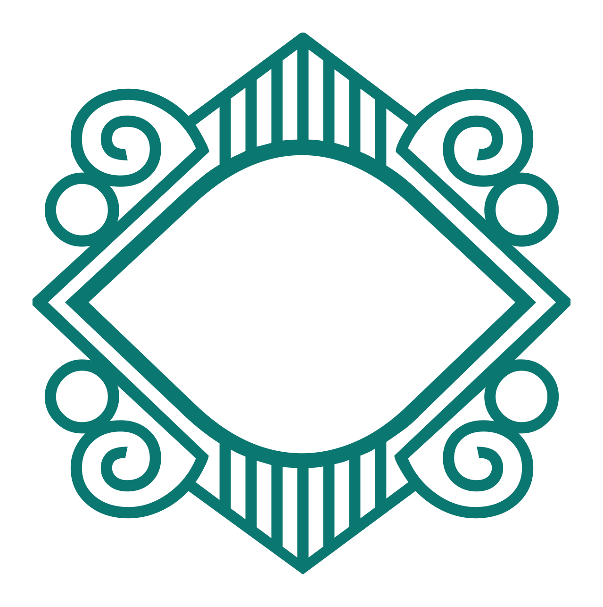
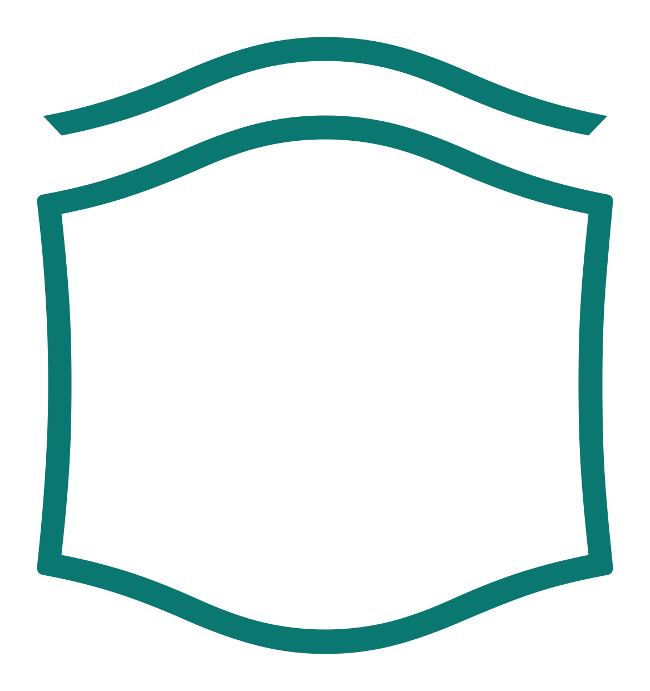
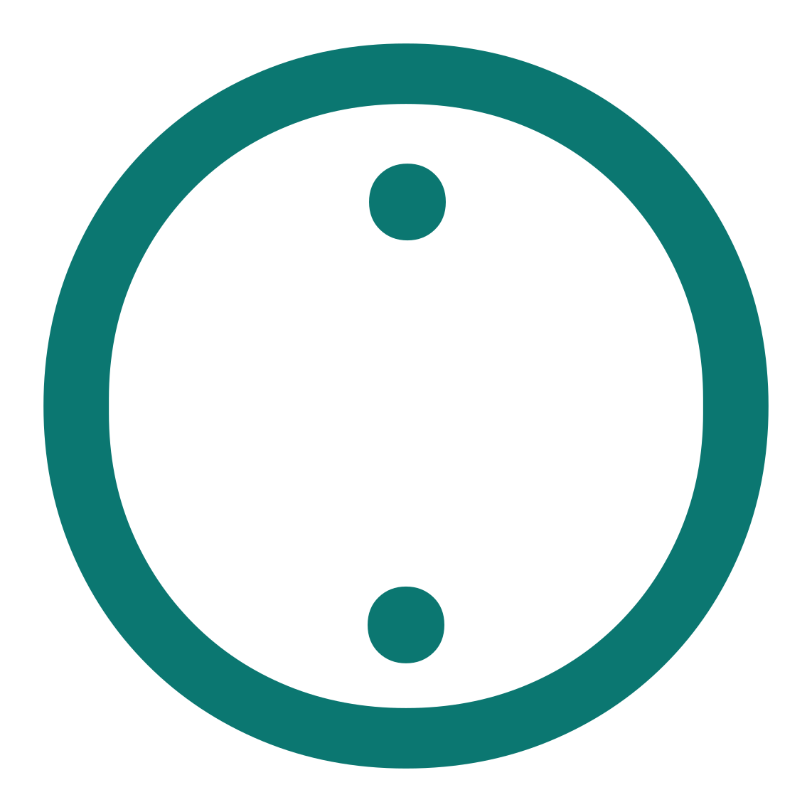
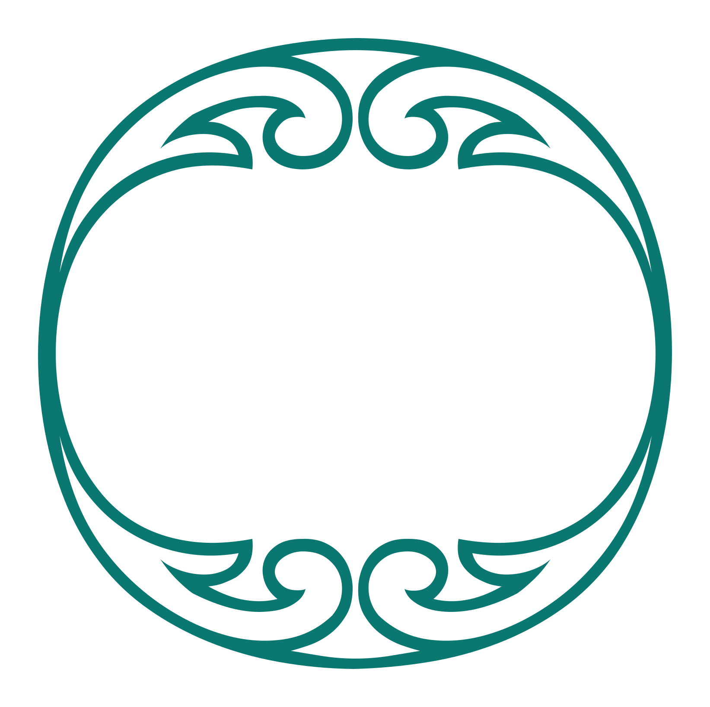
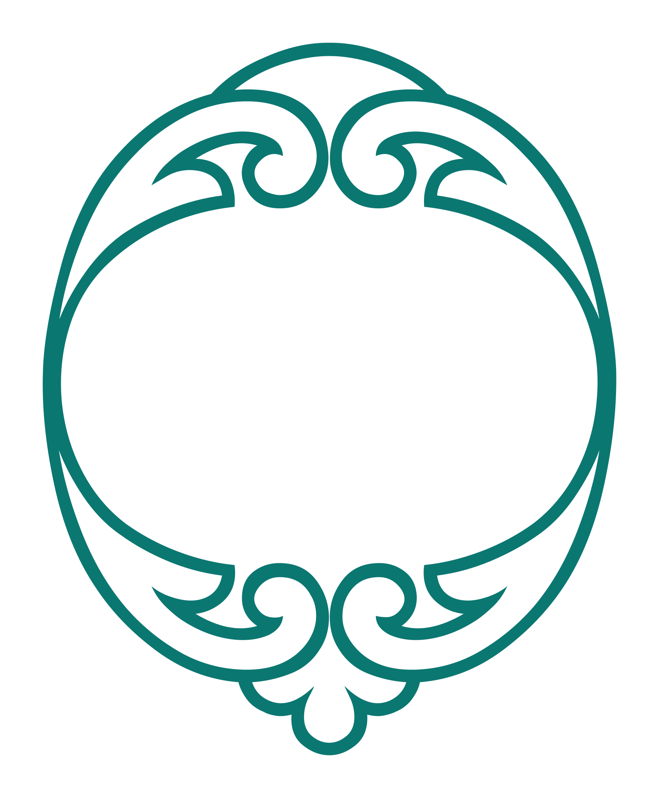

# Ayah Markers

<p align="center">
  <strong>Qur’anic end-of-ayah marks as layered SVGs and a font.</strong><br>
  20 designs · 47 weights · recolour from CSS
</p>

<p align="center">
  <a href="https://quranpedia.github.io/ayah-markers/demo/"><strong>Open the demo →</strong></a> ·
  <a href="dist/AyahMarkers.otf">OTF</a> ·
  <a href="dist/AyahMarkers.ttf">TTF</a> ·
  <a href="docs/USAGE.md">SVG guide</a>
</p>

---

Each marker is split into named layers — base fill, inner fills, ink outlines, ornament marks — so one SVG restyles itself from CSS variables.

## Use the SVGs

Pick a design in the demo, choose its weight, set the colours, then **Copy CSS**:

```css
/* 001-regular */
.ayah-marker {
  --fill-base: #fff8e7;
  --fill-1: #f4e9bc;
  --fill-2: #d6ad43;
  --ink-base: #083a3a;
}
```

Every available variable is listed in [docs/USAGE.md](docs/USAGE.md).

## Use the font

Markers are mapped to the Private Use Area from U+E000. See [font-map.json](dist/font-map.json) for the glyph you want.

```css
@font-face {
  font-family: "Ayah Markers";
  src: url("./AyahMarkers.otf") format("opentype");
}

.ayah-mark { font-family: "Ayah Markers"; }
```

```html
<span class="ayah-mark">&#xE000;</span>
```

## Run it locally

```sh
python3 -m http.server 8000   # then open localhost:8000/demo/
```

## Build

```sh
python3 -m venv .venv && .venv/bin/pip install -r requirements.txt
.venv/bin/python scripts/build_selected_font.py   # OTF, TTF, font map
```

## Markers

| | Design | Weights |
| --- | --- | --- |
|  | **001** | [Regular](markers/008-001-regular.svg) |
|  | **002** | [Regular](markers/048-002-regular.svg) · [Bold](markers/026-002-bold.svg) |
|  | **003** | [Thin](markers/003-003-thin.svg) · [ExtraLight](markers/017-003-extralight.svg) · [Light](markers/023-003-light.svg) · [Regular](markers/042-003-regular.svg) · [Medium](markers/009-003-medium.svg) · [SemiBold](markers/028-003-semibold.svg) · [Bold](markers/044-003-bold.svg) · [ExtraBold](markers/006-003-extrabold.svg) · [Black](markers/018-003-black.svg) |
|  | **005** | [Thin](markers/033-005-thin.svg) · [ExtraLight](markers/039-005-extralight.svg) · [Light](markers/014-005-light.svg) · [Regular](markers/032-005-regular.svg) · [Medium](markers/027-005-medium.svg) · [SemiBold](markers/037-005-semibold.svg) · [Bold](markers/022-005-bold.svg) |
|  | **006** | [Regular](markers/011-006-regular.svg) |
|  | **007** | [Regular](markers/038-007-regular.svg) |
|  | **008** | [Regular](markers/029-008-regular.svg) · [Medium](markers/045-008-medium.svg) · [Bold](markers/047-008-bold.svg) |
|  | **010** | [ExtraLight](markers/015-010-extralight.svg) · [Light](markers/024-010-light.svg) · [Medium](markers/049-010-medium.svg) · [Bold](markers/005-010-bold.svg) · [Black](markers/036-010-black.svg) |
|  | **011** | [Medium](markers/019-011-medium.svg) |
|  | **013** | [Regular Bold](markers/030-013-regular-bold.svg) |
|  | **014** | [Regular Bold](markers/013-014-regular-bold.svg) |
|  | **015** | [Thin](markers/004-015-thin.svg) · [ExtraLight](markers/043-015-extralight.svg) · [Light](markers/040-015-light.svg) · [Regular Black](markers/001-015-regular-black.svg) |
|  | **017** | [Regular](markers/016-017-regular.svg) · [Medium](markers/010-017-medium.svg) · [SemiBold](markers/025-017-semibold.svg) · [Bold](markers/031-017-bold.svg) |
|  | **020** | [Regular](markers/002-020-regular.svg) |
|  | **021** | [Regular](markers/041-021-regular.svg) |
|  | **022** | [Regular](markers/034-022-regular.svg) |
|  | **023** | [Regular](markers/020-023-regular.svg) |
|  | **024** | [Regular](markers/021-024-regular.svg) |
|  | **025** | [Regular](markers/012-025-regular.svg) |
|  | **026** | [Regular](markers/046-026-regular.svg) |

Each file is a plain SVG — open it, or use the [demo](https://quranpedia.github.io/ayah-markers/demo/) to colour it first.

## Layout

```text
markers/          source SVG outlines
annotations.json  layer assignments per marker
collection.json   order, sizes, and source attribution
demo/             the customizer
dist/             OTF, TTF, font map
scripts/          collection and font build tools
```

## Licensing

The source outlines keep the licences, attribution requirements, and Reserved Font Name terms of their original families — see `collection.json` before redistributing. This repository does not grant a licence to those outlines.
