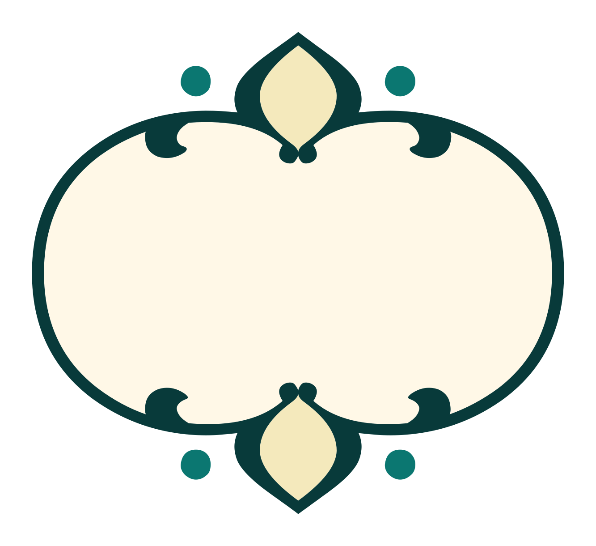
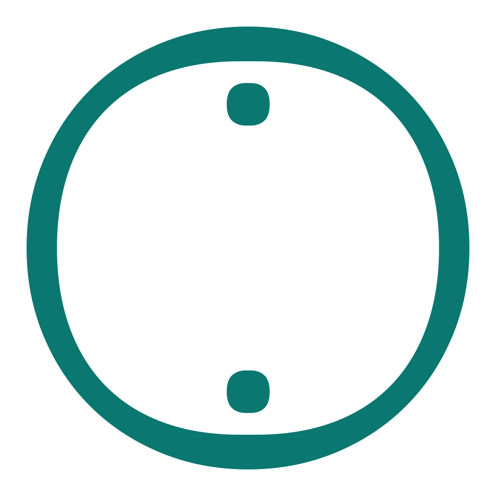
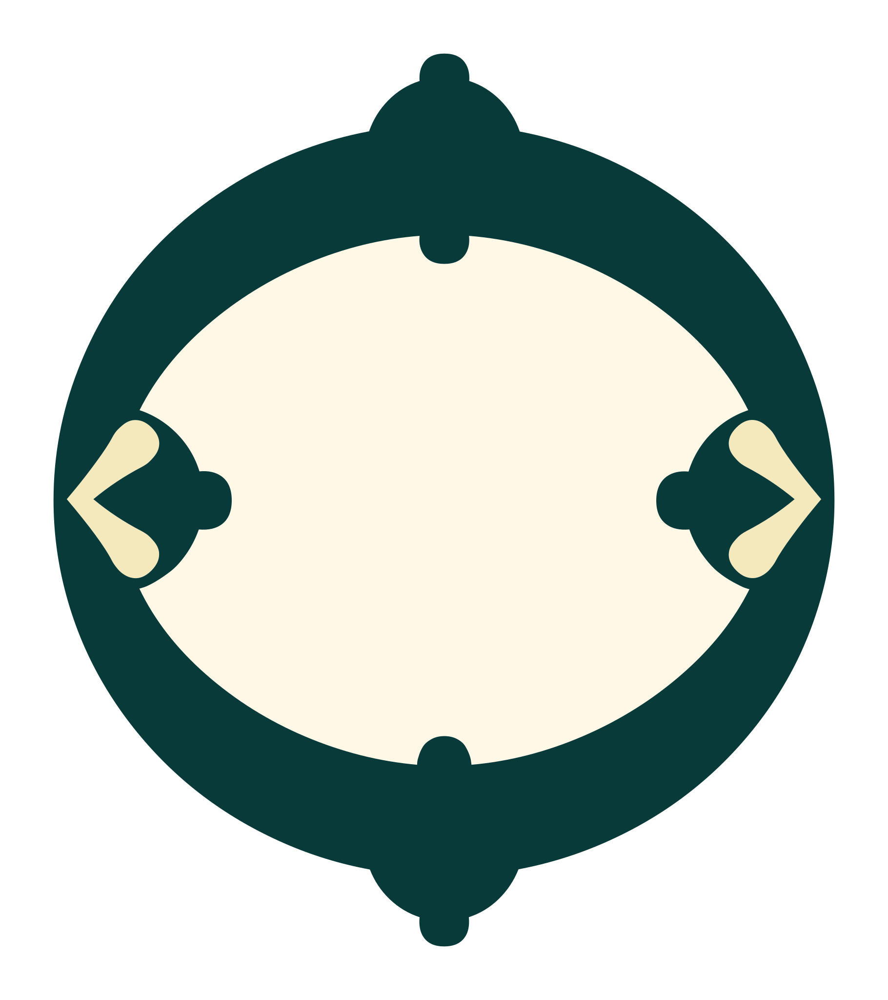
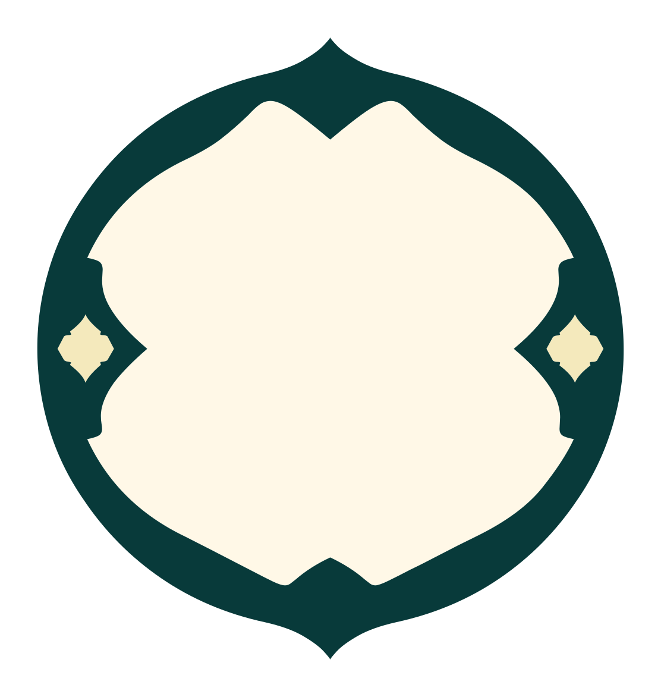
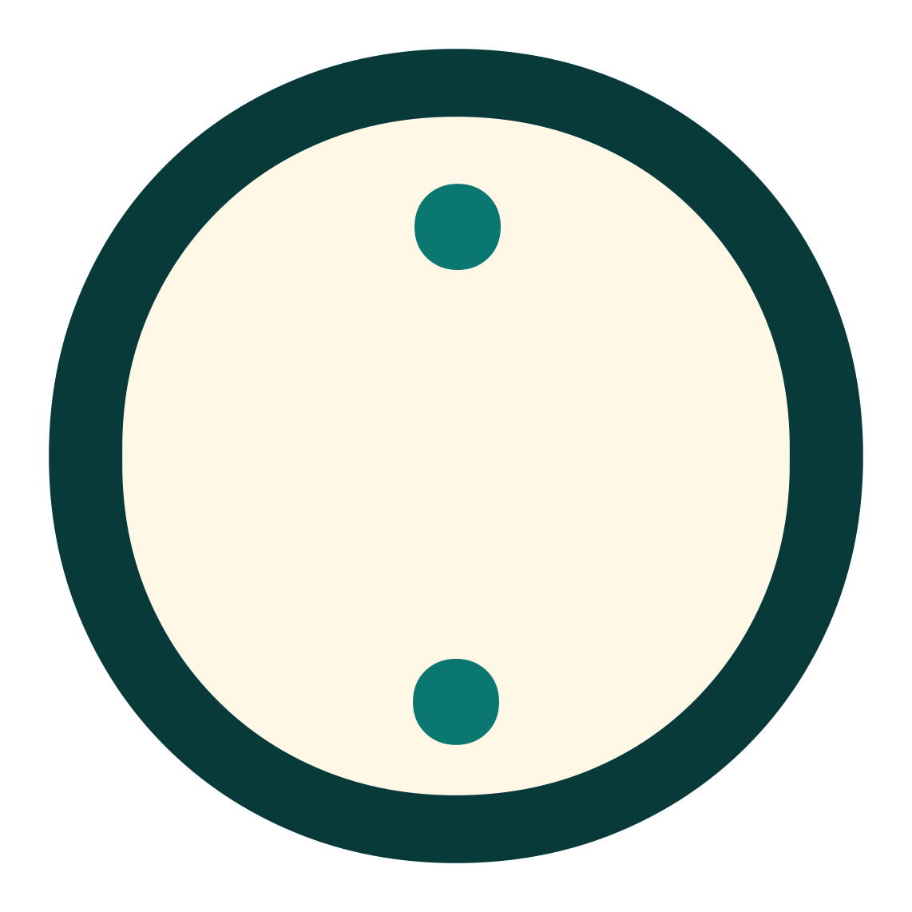
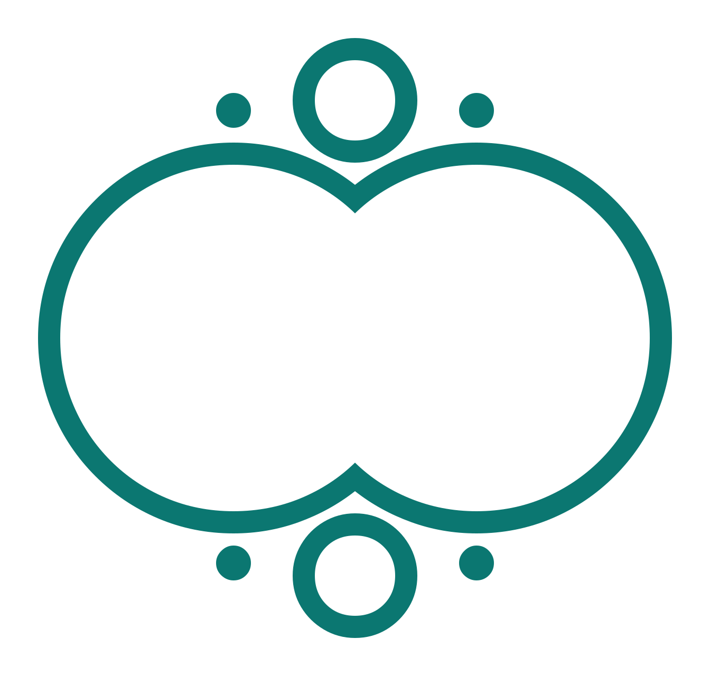
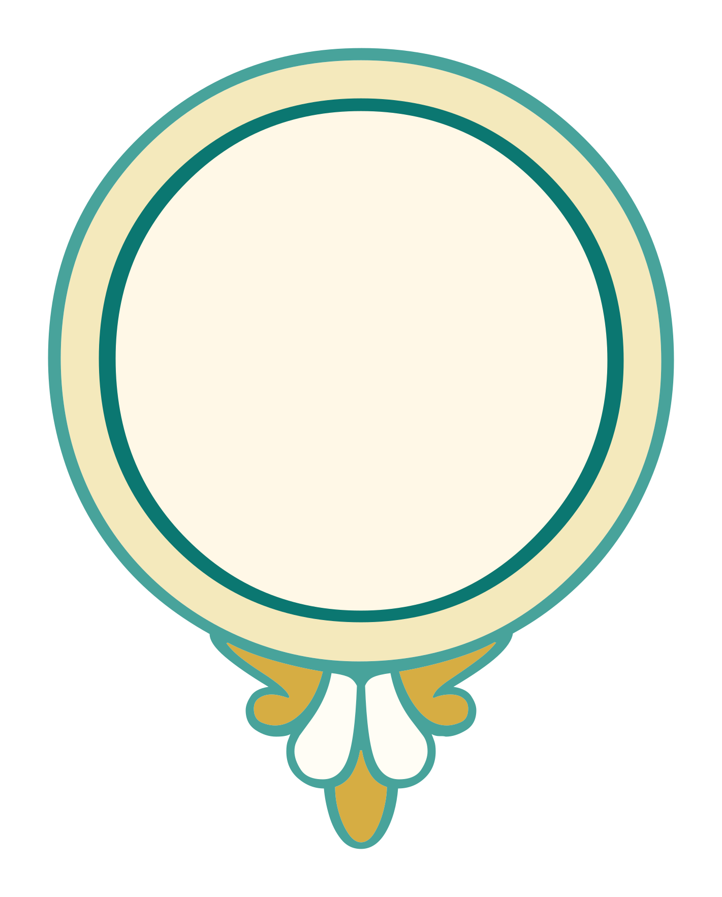
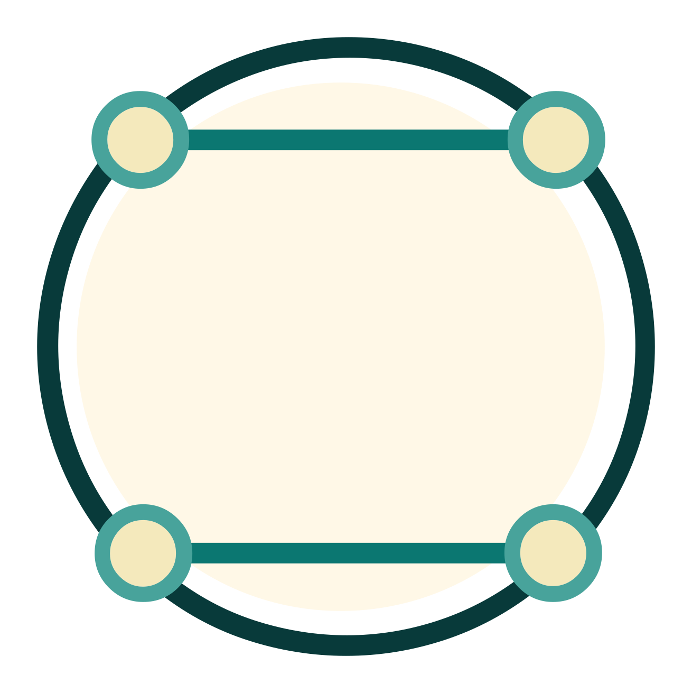
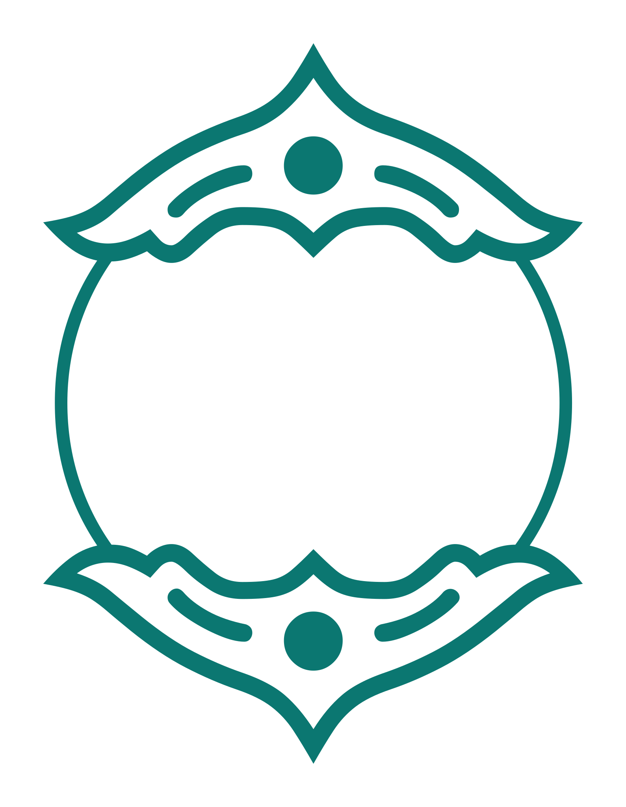
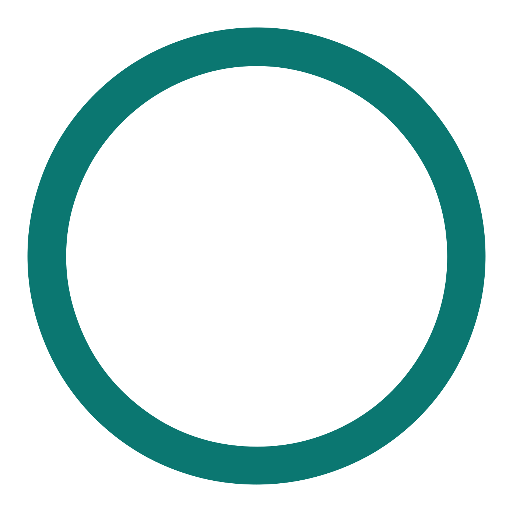

# Ayah Markers

<p align="center">
  <strong>Qur’anic end-of-ayah marks as SVG outlines and a font.</strong><br>
  20 designs · 47 weights · recolour from CSS
</p>

<p align="center">
  <a href="https://quranpedia.github.io/ayah-markers/demo/"><strong>Open the demo →</strong></a> ·
  <a href="dist/AyahMarkers.otf">OTF</a> ·
  <a href="dist/AyahMarkers.ttf">TTF</a> ·
  <a href="docs/USAGE.md">SVG guide</a>
</p>

---

## How a marker is stored

**The files in `markers/` are not layered.** Each one is a single `<path>` holding
every contour of the glyph, on an `<svg>` with a hardcoded `fill="#0b7771"`. There
are no groups, no classes, and no CSS variables in the file. Opened on its own it
draws in that one colour, and nothing in it responds to styling.

The layering lives in **`annotations.json`**, which assigns each contour of that
path to a colour class by index:

```json
"011-regular-bold": {
  "parts": {
    "fill-base": ["path-0-contour-1"],
    "ink-1":     ["path-0-contour-2"],
    "ink-2":     ["path-0-contour-0"]
  }
}
```

`path-0-contour-N` is the Nth `M`-command subpath of the Nth `<path>` in the file.
A consumer reads the outline and the annotation together and builds the layered
SVG itself. The contract, including `interiorFills` and `generatedFills`, is in
[docs/USAGE.md](docs/USAGE.md); `demo/app.js` is the reference implementation.

**Splitting the path naively destroys the counters.** A hole and the shape it
punches routinely sit in different layers by design, so when a layer is emitted as
its own `<path>` every contour of an earlier layer that lies inside one of its own
contours must be re-included, with `fill-rule="evenodd"`, to punch the hole again.
Containment has to be decided by real point-in-path testing
(`SVGGeometryElement.isPointInFill`), not by bounding boxes, which overlap for
concentric ornaments. `demo/app.js` does this; copy it rather than reinventing it.

Two further details worth knowing:

- A contour listed in no part is drawn as `ink-base`.
- A marker with no annotations of its own borrows them from another weight of the
  same numeric family.

## Where the ayah number goes

A marker holds the ayah number **inside** it, and centring the number on the
marker's overall bounding box gets it wrong whenever the design is not
symmetric. `011-regular-bold` is a disc with a flourish hanging below it, so the
bbox centre lands 174 units low, on the join between disc and flourish, instead
of in the disc.

Every marker in `collection.json` therefore carries a `number` block, in the
same coordinate space as its outline:

```json
"number": {
  "source": "font-shaping",
  "cx": 862.5, "cy": 601.5, "placement": "manual",
  "width": 730.0, "height": 305.0,
  "r": 483.8,
  "digits": {
    "1": { "width": 226.0, "height": 304.0, "source": "font-shaping" },
    "2": { "width": 478.0, "height": 313.0, "source": "font-shaping", "ring_alternate": true },
    "3": { "width": 730.0, "height": 305.0, "source": "font-shaping", "ring_alternate": true }
  },
  "derived":  { "cx": 863.4, "cy": 601.4, "width": 691.3, "height": 685.5, "r": 483.8, "region": "fill-base" },
  "font": { "family": "Noto Nastaliq Urdu", "file": "NotoNastaliqUrdu[wght].ttf",
            "glyph": "AyahEnd", "mechanism": "positioned-digits" }
}
```

- `cx`, `cy` — where to centre the numeral. **One centre per marker**: the
  number sits in the same place whether it is one digit or three, so the
  `digits` entries carry size alone.
- `width`, `height` — the box it may occupy. A one-digit number needs far less
  width than a three-digit one, so **use `digits["1"|"2"|"3"]`** for the count
  you are drawing; the top-level values are the three-digit box.
- `r` — radius of the largest circle inscribed in the marker's interior, for
  consumers that want a circular badge rather than a box.
- `derived` — the geometric answer, always present, plus the largest box that
  fits the interior at all.
- `source` — **`font-shaping`** or **`derived`**, per marker and per digit
  count, so a computed value is never mistaken for the designer's own. It
  describes where the box's **size** came from.
- `placement` — **`manual`** when the centre was set by hand on the placement
  sheet, which is the case for all 47 markers. Where it is absent the centre is
  whatever `source` computed.

### `font-shaping`: the type designer already answered

U+06DD ARABIC END OF AYAH is a prefixed format control — it is defined to
enclose the digits that follow it — and 9 of the 26 source families implement
that in OpenType. Shaping `U+06DD` + digits in the real font shows exactly where
the digits land and how big they are drawn, which is the designer's own answer.
Three mechanisms appear, and all three are read:

| mechanism | what the font does | example |
| --- | --- | --- |
| `positioned-digits` | digit glyphs with no advance, offset onto the marker | Estedad, Amiri, `uni0667.small` |
| `ring-alternate` | as above, plus a wider ring as the number grows | Noto Sans Arabic `uni06DD.2`, `AyahEnd.alt3` |
| `precomposed` | the whole run becomes one glyph that already contains the number | DigitalKhatt V1 `endofaya255` |

A font counts as enclosing only when the digits carry essentially no advance of
their own. Over the 26 families the two cases do not overlap: enclosing fonts
spend 0–12% of the marker's advance on the digits, non-enclosing ones 100–130%.

25 of the 47 markers get their box this way (24 for all three digit counts,
`001-regular` for one — see the exception below).

### `derived`: the geometry, for the fonts that stay silent

For the other 22 markers the box is computed from the outline:

1. Rasterise the marker's path with the nonzero winding rule — the ink.
2. Any non-ink area that does not reach the outside of the drawing is an
   enclosed region, a counter of the design. A number can only live in one.
3. Pick the counter that overlaps the `fill-base` region named in
   `annotations.json` — that annotation already identifies the enclosed interior
   of the main body. Falling back, in order, to the `generatedFills` ellipse
   recorded for `fill-base` (the `012` family, which has no interior contour),
   then to the largest counter, then to the bounding box.
4. `cx, cy` is the **centre of that region**; `r` is the largest circle
   inscribed in it.
5. `width, height` scale with the digit count, using the ratios the designers
   who did answer actually use.

Two of those steps were decided by measurement against the 24 markers whose font
states the answer, not by taste:

- **Centre.** The centre of the region beats the centre of the largest inscribed
  circle: horizontal error median 0.4% of the region's width against 1.8%, mean
  0.6% against 6.0%, worst case 2.5% against 14.5%. The two differ only where an
  ornament intrudes on one side — the `004`, `007` and `008` families draw dots
  inside the ring — and there the designers never once agreed with the inscribed
  circle.
- **Size.** A designer draws the number at a near-constant 0.39–0.41 of the
  region's height whatever the digit count, and at 0.29 / 0.53 / 0.77 of its
  width for one, two and three digits. Those medians size the derived boxes, and
  a derived box is never allowed to exceed the largest rectangle that actually
  fits the region.

The derived centre then agrees with the designers to a median 0.5% of the region
horizontally and 2% vertically.

### Exceptions

`001-regular` (Alkalami) is the one marker whose font answer had to be refused.
Alkalami swaps in a wider ring (`uni06DD.2`, `uni06DD.3`) for two and three
digits, and that wider ring's number box covers 15% ink on the outline this
repository ships. Its one-digit box is the font's; two and three digits fall back
to the derived rule, and each records a `fallback_reason` saying so.

`scripts/number_exceptions.json`, if present, is merged in as
`number.exception`.

### Hand-placed centres

The sizes above are computed and never touched. The **centres** are not: every
one of the 47 markers was centred by eye on the placement sheet, and those
centres are the product this repository ships.

They live in `scripts/number_placement.json`, one entry per marker and digit
count:

```json
"011-regular-bold": {
  "1": { "cx": 862.5, "cy": 601.5 },
  "2": { "cx": 862.5, "cy": 601.5 },
  "3": { "cx": 862.5, "cy": 601.5 }
}
```

`build_number_boxes.py` applies that file last. It moves a box and never
resizes one, so the computed width, height and `source` survive intact and each
box it moves is marked `"placement": "manual"`. Delete an entry and that box
falls back to its computed centre; delete the file and the whole collection
does.

The centres are set in [docs/number-placement.html](docs/number-placement.html):
click a part of a marker to select it, centre the number on that part's bounds
horizontally, vertically or both, and the sheet saves each placement to the
browser as you go. **Copy JSON patch** emits the entry for the selected marker
in the shape above.

### Checking it

```sh
python3 scripts/fetch_source_fonts.py        # the real TTF/OTFs, not the woff2 subsets
python3 scripts/derive_number_box.py         # the geometric rule
python3 scripts/derive_number_font.py        # the fonts' own answer
python3 scripts/build_number_boxes.py        # merge into collection.json + the sheets
python3 scripts/check_number_boxes.py        # gate: no box may sit on ink
```

`check_number_boxes.py` rasterises every marker and measures how much of each
recorded box is covered by the marker's own ink. All 141 boxes pass, and since
the centres were placed by hand none of them touches ink at all.

Two contact sheets render the result:

- [docs/number-placement.html](docs/number-placement.html) — all 47 markers with
  one, two and three digits placed in the recorded box, labelled with the
  source. This is also the editor the centres are set in.
- [docs/number-placement-baseline.html](docs/number-placement-baseline.html) —
  the derived centre against the naive bounding-box centre. They agree on 32
  markers, as they should for a symmetric design, and disagree by up to 174 units
  on the rest.

> **Note on orientation.** The files in `markers/` are the fonts' U+06DD outlines
> with the y axis *not* flipped, so they render vertically mirrored relative to
> the source font — `011`'s flourish is above the disc in Noto Nastaliq Urdu and
> below it in the SVG. That is a pre-existing property of the artwork and nothing
> here changes it; the `number` boxes are in the SVG's own space, so they land
> correctly on the marker as shipped.

## Use the SVGs

Pick a design in the demo, choose its weight, set the colours, then **Copy CSS**.
The demo builds the layered SVG for you; the CSS it copies styles that output, not
the file in `markers/`:

```css
/* 001-regular */
.ayah-marker {
  --fill-base: #fff8e7;
  --fill-1: #f4e9bc;
  --fill-2: #d6ad43;
  --ink-base: #083a3a;
}
```

Every available variable is listed in [docs/USAGE.md](docs/USAGE.md).

## Use the font

Markers are mapped to the Private Use Area from U+E000. See [font-map.json](dist/font-map.json) for the glyph you want.

```css
@font-face {
  font-family: "Ayah Markers";
  src: url("./AyahMarkers.otf") format("opentype");
}

.ayah-mark { font-family: "Ayah Markers"; }
```

```html
<span class="ayah-mark">&#xE000;</span>
```

## Run it locally

```sh
python3 -m http.server 8000   # then open localhost:8000/demo/
```

## Build

```sh
python3 -m venv .venv && .venv/bin/pip install -r requirements.txt
.venv/bin/python scripts/build_selected_font.py   # OTF, TTF, font map
```

## Markers

| | Design | Weights |
| --- | --- | --- |
|  | **001** | [Regular](markers/001-regular.svg) |
|  | **002** | [Regular](markers/002-regular.svg) · [Bold](markers/002-bold.svg) |
|  | **003** | [Thin](markers/003-thin.svg) · [ExtraLight](markers/003-extralight.svg) · [Light](markers/003-light.svg) · [Regular](markers/003-regular.svg) · [Medium](markers/003-medium.svg) · [SemiBold](markers/003-semibold.svg) · [Bold](markers/003-bold.svg) · [ExtraBold](markers/003-extrabold.svg) · [Black](markers/003-black.svg) |
|  | **004** | [Thin](markers/004-thin.svg) · [ExtraLight](markers/004-extralight.svg) · [Light](markers/004-light.svg) · [Regular](markers/004-regular.svg) · [Medium](markers/004-medium.svg) · [SemiBold](markers/004-semibold.svg) · [Bold](markers/004-bold.svg) |
|  | **005** | [Regular](markers/005-regular.svg) |
|  | **006** | [Regular](markers/006-regular.svg) |
|  | **007** | [Regular](markers/007-regular.svg) · [Medium](markers/007-medium.svg) · [Bold](markers/007-bold.svg) |
|  | **008** | [ExtraLight](markers/008-extralight.svg) · [Light](markers/008-light.svg) · [Medium](markers/008-medium.svg) · [Bold](markers/008-bold.svg) · [Black](markers/008-black.svg) |
|  | **009** | [Medium](markers/009-medium.svg) |
|  | **010** | [Regular Bold](markers/010-regular-bold.svg) |
|  | **011** | [Regular Bold](markers/011-regular-bold.svg) |
|  | **012** | [Thin](markers/012-thin.svg) · [ExtraLight](markers/012-extralight.svg) · [Light](markers/012-light.svg) · [Regular Black](markers/012-regular-black.svg) |
|  | **013** | [Regular](markers/013-regular.svg) · [Medium](markers/013-medium.svg) · [SemiBold](markers/013-semibold.svg) · [Bold](markers/013-bold.svg) |
|  | **014** | [Regular](markers/014-regular.svg) |
|  | **015** | [Regular](markers/015-regular.svg) |
|  | **016** | [Regular](markers/016-regular.svg) |
|  | **017** | [Regular](markers/017-regular.svg) |
|  | **018** | [Regular](markers/018-regular.svg) |
|  | **019** | [Regular](markers/019-regular.svg) |
|  | **020** | [Regular](markers/020-regular.svg) |

Each file is a plain SVG — open it, or use the [demo](https://quranpedia.github.io/ayah-markers/demo/) to colour it first.

## Layout

```text
markers/          source SVG outlines, one <path> each, unlayered
annotations.json  contour-to-layer assignments per marker
collection.json   order, sizes, number placement, source attribution and licences
scripts/number_placement.json
                  the hand-placed number centres the build applies
LICENSES.md       the source families' terms, in full
demo/             the customizer
dist/             OTF, TTF, font map
scripts/          collection and font build tools
```

## Licensing

**See [LICENSES.md](LICENSES.md).** Fourteen of the twenty-six source families are
under the SIL Open Font License 1.1, verified from `license: "OFL"` in each
family's `METADATA.pb` in [google/fonts](https://github.com/google/fonts). The OFL
permits redistribution provided the licence and copyright notice travel with the
material, no Reserved Font Name is used for a modified version, and derivatives
stay under the OFL.

The remaining twelve families come from `fonts.quran.ws` and their terms are **not
verified**. They are marked `unverified — pending confirmation` rather than
guessed; do not redistribute those markers until their terms are confirmed.

Every source's licence is recorded machine-readably in `collection.json` under
`markers[].sources[].license`.

This repository has no `LICENSE` file of its own, and `LICENSES.md` documents the
sources' terms without granting anything on the repository's behalf.
